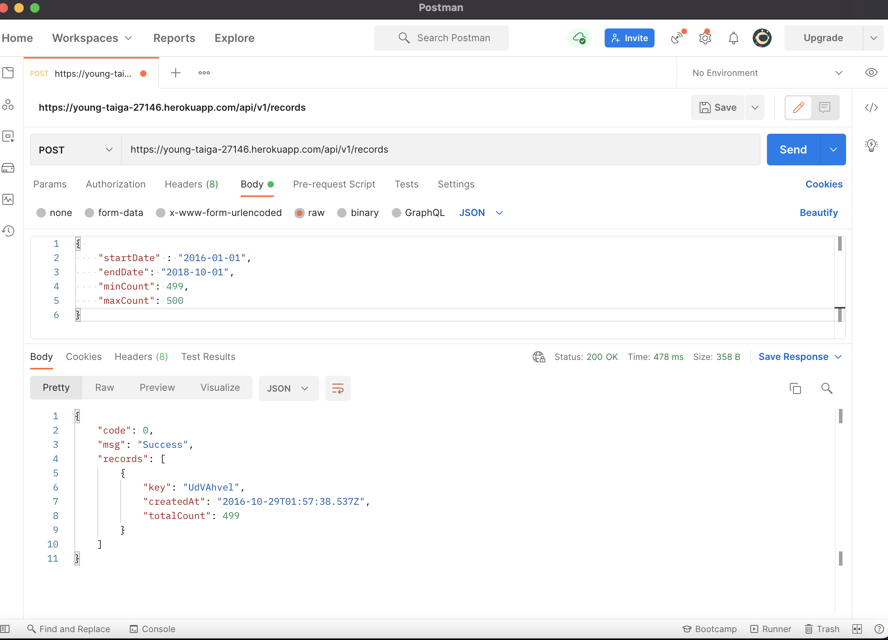
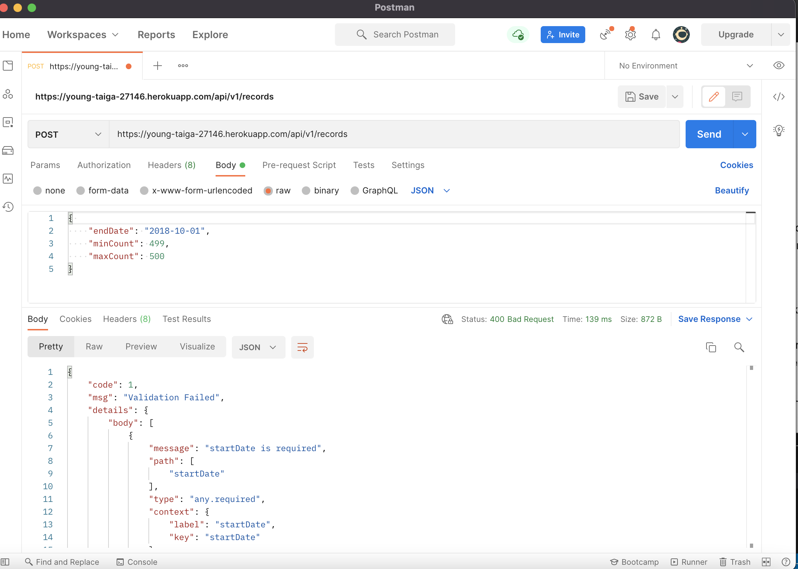
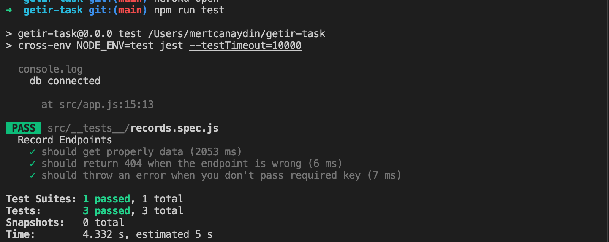

# Getir Node.js Bootcamp Graduation Project

## Table of Contents

- [Installation](#installation)
- [Demo Link](#demo)
- [Getting Started](#getting-started)
- [Screen Shots](#screen-shots)

## Installation

**For Mac :**

```
$ git clone <project_github_url_here>
$ cd <project_name>
$ npm install
$ create .env file, then fill it out
 - DB_URL=<mongo_uri>
 - PORT:3000

```

When the installation completes, open the http://localhost:3000/api/v1/records`.

## Demo

- [heroku link](https://young-taiga-27146.herokuapp.com/api/v1/records)

## Getting Started

For that project, we've only one endpoint which is `/api/v1/records`

- sample payload

```
  {
      "startDate" : "2016-01-01",
      "endDate": "2018-10-01",
      "minCount": 499,
      "maxCount": 500
  }
```

- sample response

```
{
    "code": 0,
    "msg": "Success",
    "records": [
        {
            "key": "UdVAhvel",
            "createdAt": "2016-10-29T01:57:38.537Z",
            "totalCount": 499
        }
    ]
}
```

## Screen Shots

- Sample api request and response on Postman

# 

- Sample bad request to get validation error on Postman

# 

- Jest + supertest

# 
